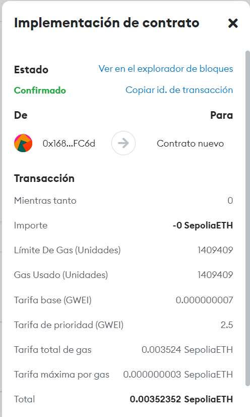
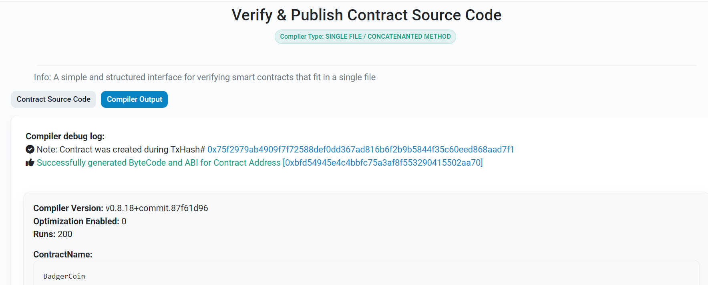

# WEB-3-MASTERY

Smart Contract del Token BadgerCoin para obtener certificado de Web 3 Mastery

>>> BadgerCoin.sol
'''
// SPDX-License-Identifier: MIT
pragma solidity ^0.8.9;

import "@openzeppelin/contracts@4.8.2/token/ERC20/ERC20.sol";
import "@openzeppelin/contracts@4.8.2/access/Ownable.sol";

contract BadgerCoin is ERC20, Ownable {
    constructor() ERC20("BadgerCoin", "BC") {
          _mint(msg.sender,  1000000 * 10 ** decimals());
    }
}
'''

## Transacción del contrato

## Contrato verificado y publicado

